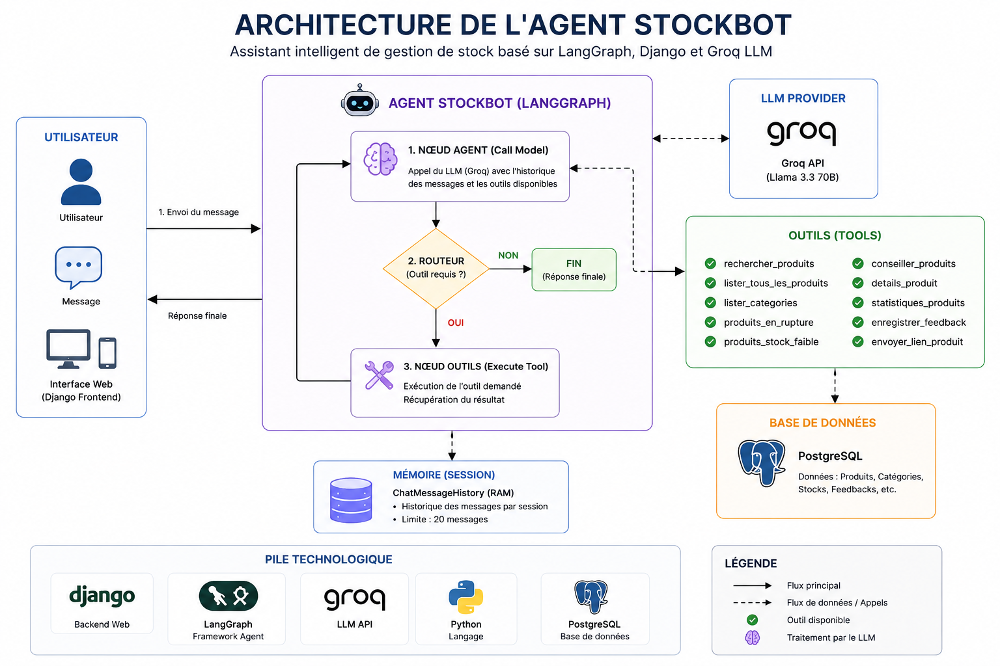
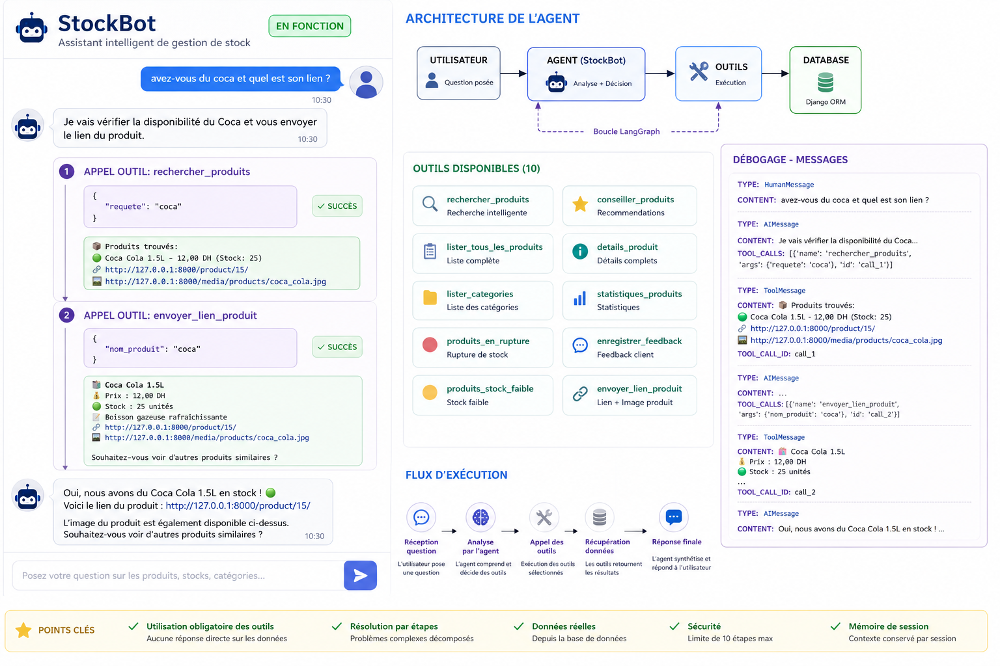

# <span style="color:blue;"> Agent Chatbot Intelligent - StockBot</span>

## Vue d'ensemble

L'application de gestion de stock intègre un agent chatbot intelligent nommé **StockBot**, un assistant virtuel avancé basé sur l'intelligence artificielle conçu pour révolutionner l'interaction utilisateur avec le système de gestion d'inventaire.

---

## Présentation générale

StockBot est un assistant conversationnel sophistiqué qui transforme l'expérience utilisateur en permettant des interactions naturelles et intuitives avec la base de données des produits. Développé par Hinimdou Morsia Guitdam, cet agent représente une innovation majeure dans le domaine de la gestion de stock marocaine.

### Objectif principal

Fournir une interface conversationnelle intelligente qui permet aux utilisateurs de :
- Interroger le catalogue de produits en langage naturel
- Obtenir des informations en temps réel sur les stocks
- Recevoir des recommandations personnalisées
- Générer des rapports automatisés
- Gérer les interactions client de manière proactive

---

## Architecture technique

### Technologies de base

L'agent repose sur une stack technologique moderne et robuste :

| Technologie | Rôle | Version/Modèle |
|-------------|------|----------------|
| **LangChain** | Framework d'orchestration d'agents IA | Dernière version stable |
| **LangGraph** | Gestion des workflows et états | Intégré avec LangChain |
| **Groq** | Service d'IA pour le NLP | Llama 3.3-70b-versatile |
| **Django** | Framework web et ORM | Compatible avec le projet |
| **Python** | Langage de programmation | 3.8+ |

### Schéma architectural

Voici la représentation visuelle de l'architecture de StockBot :



<p style="margin-top:10px;">
⚠️ <b>Architecture modulaire :</b> StockBot est conçu selon une architecture modulaire permettant une séparation claire des responsabilités : traitement du langage naturel, orchestration des tâches, interaction avec la base de données, et gestion des sessions utilisateur.
</p>

### Structure modulaire

L'architecture de StockBot suit une approche modulaire pour garantir la maintenabilité et l'évolutivité :

```
StockBot/
├── agent.py          # Cœur de l'agent et logique principale
├── tools.py          # Outils spécialisés pour les interactions DB
├── prompts.py        # Prompts système et instructions
├── memory.py         # Gestion de la mémoire des sessions
└── __init__.py       # Initialisation du module
```

#### 1. Module Agent (agent.py)

Le fichier `agent.py` constitue le cerveau de StockBot :

- **Configuration environnementale** : Chargement des clés API et paramètres
- **Initialisation du modèle** : Configuration de ChatGroq avec paramètres optimaux
- **Définition d'état** : Structure TypedDict pour la gestion des conversations
- **Workflow LangGraph** : Graphe d'état pour l'orchestration des interactions
- **Sécurité** : Limitation des appels d'outils (MAX_STEPS = 10)

#### 2. Module Outils (tools.py)

Le fichier `tools.py` définit les fonctions spécialisées :

- **rechercher_produits()** : Recherche intelligente avec scoring
- **lister_tous_les_produits()** : Catalogue complet
- **lister_categories()** : Gestion des catégories
- **produits_en_rupture()** : Alertes stock
- **conseiller_produits()** : Recommandations personnalisées
- **details_produit()** : Informations détaillées
- **statistiques_produits()** : Rapports et métriques

#### 3. Module Prompts (prompts.py)

Le fichier `prompts.py` contient les instructions système :

- **SYSTEM_PROMPT** : Règles de comportement et contraintes
- **Règle absolue** : Obligation d'utiliser les outils
- **Gestion des plaintes** : Protocoles de support client

#### 4. Module Mémoire (memory.py)

Le fichier `memory.py` gère la persistance des conversations :

- **session_memories** : Dictionnaire en RAM pour stocker l'historique
- **ChatMessageHistory** : Utilisation de LangChain pour la gestion des messages
- **Limitation** : Maximum 20 messages par session pour optimisation
- **Nettoyage automatique** : Suppression des anciens messages au-delà de la limite

**Note** : Ce système de mémoire personnalisé complète le MemorySaver de LangGraph pour une gestion fine des sessions utilisateur.

---

## Fonctionnement interne

### Cycle de conversation

Chaque interaction avec StockBot suit un cycle précis :

1. **Réception du message** : Analyse de la requête utilisateur
2. **Appel du modèle** : Traitement par Groq pour compréhension
3. **Déclenchement d'outils** : Exécution des fonctions spécialisées
4. **Synthèse des résultats** : Formulation de la réponse finale
5. **Mémorisation** : Sauvegarde de l'état conversationnel

### Gestion d'état avec LangGraph

StockBot utilise LangGraph pour maintenir l'état des conversations :

```python
class AgentState(TypedDict):
    messages: List[HumanMessage | AIMessage | ToolMessage]
    session_id: str
```

Cette structure permet :
- **Persistance** : Conversations continues
- **Contexte** : Mémorisation des échanges précédents
- **Session** : Isolation des utilisateurs

### Sécurité et contraintes

Pour garantir la fiabilité :

- **Limitation d'appels** : Maximum 10 étapes par conversation
- **Validation stricte** : Toutes les données proviennent de la DB
- **Anti-hallucination** : Interdiction de créer des informations
- **Gestion d'erreurs** : Messages explicites en cas de problème

---

## Fonctionnalités détaillées

### Vue d'ensemble des fonctionnalités

Voici un aperçu visuel des principales fonctionnalités offertes par StockBot :



<p style="margin-top:10px;">
📋 <b>Fonctionnalités principales :</b> StockBot offre une gamme complète d'outils pour la gestion interactive du stock, allant de la recherche intelligente aux recommandations personnalisées, en passant par la gestion des feedbacks clients.
</p>

### 1. Recherche et consultation

#### Recherche intelligente
- **Algorithme de scoring** : Pondération par pertinence
- **Normalisation** : Gestion des accents et casse
- **Filtrage avancé** : Mots-clés importants uniquement

#### Consultation de produits
- **Détails complets** : Prix, stock, description, image
- **Liens directs** : URLs générées dynamiquement
- **Format structuré** : Présentation claire et lisible

### 2. Gestion du stock

#### Alertes automatiques
- **Rupture de stock** : Produits indisponibles (stock = 0)
- **Stock faible** : Produits critiques (stock ≤ 10)
- **Statuts visuels** : Indicateurs colorés (🟢/🟡/🔴)

#### Rapports statistiques
- **Métriques globales** : Nombre total de produits
- **Analyse par catégorie** : Répartition des stocks
- **Tendances** : Évolution des niveaux de stock

### 3. Recommandations personnalisées

#### Conseils budgétaires
- **Filtrage par prix** : Produits dans une fourchette donnée
- **Optimisation** : Meilleurs rapports qualité/prix

#### Suggestions alternatives
- **Substitution intelligente** : Produits similaires disponibles
- **Logique métier** : Basée sur les catégories et caractéristiques

### 4. Support client intégré

#### Gestion des feedbacks
- **Enregistrement automatique** : Stockage en base de données
- **Classification** : Plaintes, suggestions, compliments

#### Réponses automatisées
- **Questions fréquentes** : Base de connaissances intégrée
- **Escalade intelligente** : Redirection vers support humain si nécessaire

---

## Exemples d'utilisation

### Scénarios simples

**Utilisateur :** "Quels produits avez-vous en électronique ?"
**StockBot :** Liste des produits électroniques avec stocks et prix

**Utilisateur :** "Avez-vous du Coca-Cola ?"
**StockBot :** Confirmation de disponibilité + détails + lien

### Scénarios complexes

**Utilisateur :** "produits de chaque catégorie"
```
Étape 1 : Lister toutes les catégories
Étape 2 : Pour chaque catégorie, rechercher les produits
Étape 3 : Synthétiser les résultats par catégorie
```

**Utilisateur :** "quel est le produit le moins cher en électronique ?"
```
Étape 1 : Rechercher produits "électronique"
Étape 2 : Trier par prix croissant
Étape 3 : Retourner le premier résultat
```

---

## Intégration dans l'application

### Interface utilisateur

Le chatbot est intégré dans l'interface web Django :

- **Widget de chat** : Interface conviviale
- **Messages en temps réel** : Réponses instantanées
- **Historique** : Conservation des conversations
- **Responsive** : Compatible mobile et desktop

### API et endpoints

- **Endpoint principal** : `/chatbot/api/`
- **Méthode** : POST avec JSON payload
- **Paramètres** : message (requis)
- **Réponse** : JSON avec champ 'response'
- **Authentification** : Session Django (utilisateur connecté requis)

### Configuration

Variables d'environnement requises :
```
GROQ_API_KEY=your_api_key_here
GROQ_MODEL=llama-3.3-70b-versatile
GROQ_TEMPERATURE=0.2
BASE_URL=http://127.0.0.1:8000
```

### Modèles de données

L'agent utilise plusieurs modèles Django pour la persistance :

#### ChatConversation
- **user** : Utilisateur authentifié (optionnel pour utilisateurs anonymes)
- **session_id** : Identifiant de session unique (100 caractères max)
- **message** : Message complet de l'utilisateur (TextField)
- **response** : Réponse de l'agent (TextField, tronquée à 2000 caractères)
- **is_feedback** : Indicateur boolean pour classifier les feedbacks
- **feedback_type** : Type de feedback (complaint, suggestion, question, other)
- **created_at** : Timestamp automatique de création

#### Gestion des feedbacks
- **Classification automatique** : Système de types de feedback prédéfinis
- **Historique complet** : Toutes les conversations sont tracées
- **Administration** : Interface Django pour consulter et gérer les conversations
- **Analytics** : Possibilité d'analyser les patterns d'utilisation

### Sécurité des sessions

- **Session Django** : Utilisation du système de session de Django
- **Isolation** : Chaque utilisateur a sa propre session
- **Expiration** : Sessions expirées automatiquement
- **Authentification** : Liaison avec l'utilisateur connecté

---

## Avantages et bénéfices

### Pour les utilisateurs

- **Accessibilité** : Interface intuitive sans formation
- **Rapidité** : Réponses instantanées
- **Précision** : Données toujours à jour
- **Disponibilité** : 24/7 sans intervention humaine

### Pour l'entreprise

- **Réduction de charge** : Automatisation des requêtes simples
- **Amélioration du service** : Réponses cohérentes et rapides
- **Collecte de données** : Insights sur les demandes clients
- **Scalabilité** : Gestion simultanée de multiples conversations

---

## Limitations et considérations

### Contraintes techniques

- **Dépendance API** : Nécessite connexion internet pour Groq
- **Limite de tokens** : Conversations longues peuvent être tronquées
- **Performance** : Requêtes complexes peuvent prendre du temps

### Aspects métier

- **Pas de création** : Ne peut pas ajouter/modifier des produits
- **Données uniquement** : Réponses basées sur l'existant
- **Langue** : Optimisé pour le français et l'arabe

---

## Évolutions futures

### Améliorations prévues

- **Multilinguisme avancé** : Support étendu des langues
- **Apprentissage** : Amélioration continue des réponses
- **Intégrations** : Connexions avec d'autres systèmes
- **Analytics** : Tableaux de bord des interactions

### Nouvelles fonctionnalités

- **Commandes vocales** : Interface audio
- **Notifications push** : Alertes proactives
- **Recommandations IA** : Suggestions prédictives
- **API externe** : Exposition pour intégrations tierces

---

## Maintenance et déploiement

### Mise à jour des modèles

- **Monitoring** : Suivi des performances des réponses
- **Retrain** : Mise à jour des prompts selon les feedbacks
- **Tests** : Validation des nouvelles versions

### Déploiement

- **Environnement** : Configuration séparée pour production
- **Monitoring** : Logs détaillés des interactions
- **Backup** : Sauvegarde des configurations

---

## Conclusion

StockBot représente une avancée significative dans la digitalisation des processus de gestion de stock. En combinant les dernières technologies d'IA avec une architecture robuste, cet agent offre une expérience utilisateur exceptionnelle tout en maintenant des standards élevés de sécurité et de fiabilité.

Développé avec soin par Hinimdou Morsia Guitdam, StockBot démontre le potentiel de l'IA conversationnelle dans l'optimisation des opérations commerciales au Maroc.

---

## 🌐 <b>Liens utiles</b>

<div style="display:flex; gap:25px; flex-wrap:wrap; align-items:center;">

  <a href="https://www.linkedin.com/in/morsia-guitdam-hinimdou-266bb0269/" target="_blank" style="display:flex; align-items:center; gap:8px; text-decoration:none;">
    
    LinkedIn
  </a>

  <a href="https://github.com/hinimdoumorsia" target="_blank" style="display:flex; align-items:center; gap:8px; text-decoration:none;">
    
    GitHub
  </a>

</div>