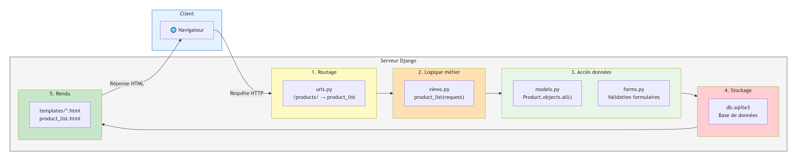

# Modélisation des données

Cette section couvre la conception et la structure de la base de données du projet, depuis le diagramme de classes jusqu'aux migrations Django.

---

## Pourquoi modéliser avant de coder ?

La modélisation permet de transformer un besoin fonctionnel en une structure claire. Elle aide à identifier les acteurs, les objets métiers, les relations, les flux d'information et les responsabilités techniques. Elle réduit les erreurs de conception avant l'écriture du code.

Dans ce projet, la modélisation s'articule à trois niveaux :

| Niveau | Question |
|---|---|
| Fonctionnel | Qui fait quoi ? |
| Structurel | Quelles données sont manipulées ? |
| Technique | Comment Django organise l'application ? |

---

## Diagramme de classes

### Entités principales

Le projet repose sur deux entités principales : `Category` et `Product`, reliées par une relation `ForeignKey`.

```
User
├── username : CharField
├── email : EmailField
├── password : CharField
└── groups : ManyToManyField
        │
        │ gère
        ▼
Category                          Product
├── id : int          ◄─────────  ├── id : int
├── name : CharField   contient   ├── name : CharField
├── description : TextField  1..N ├── description : TextField
└── created_at : DateTimeField    ├── price : DecimalField
                                  ├── stock : PositiveIntegerField
                                  ├── photo : ImageField
                                  ├── category : ForeignKey(Category)
                                  ├── created_at : DateTimeField
                                  └── updated_at : DateTimeField
```

### Règles métier

- Une catégorie peut contenir plusieurs produits
- Chaque produit appartient à une seule catégorie
- Les catégories sont gérées uniquement par le superadmin
- Les utilisateurs interagissent avec les produits selon leur rôle

### Correspondance UML → Django

| Concept UML | Traduction dans Django |
|---|---|
| Classe | Modèle dans `models.py` |
| Attribut | Champ Django (`CharField`, `DecimalField`, etc.) |
| Association 1..N | `ForeignKey` |
| Acteur | Utilisateur authentifié |
| Rôle | Groupe Django ou permission |
| Action | Vue liée à une URL |

---

## Modèle `Category`

```python
from django.db import models

class Category(models.Model):
    name        = models.CharField("Nom", max_length=120, unique=True)
    description = models.TextField("Description", blank=True)
    created_at  = models.DateTimeField(auto_now_add=True)

    class Meta:
        ordering            = ['name']
        verbose_name        = "Catégorie"
        verbose_name_plural = "Catégories"

    def __str__(self):
        return self.name
```

!!! tip "À retenir"
    Une catégorie permet d'organiser les produits par famille : informatique, bureautique, alimentation, etc.

---

## Modèle `Product`

```python
class Product(models.Model):
    STATUS_CHOICES = [
        ('available', 'Disponible'),
        ('low',       'Stock faible'),
        ('out',       'Rupture'),
    ]

    name        = models.CharField("Nom du produit", max_length=150)
    description = models.TextField("Description", blank=True)
    price       = models.DecimalField("Prix", max_digits=10, decimal_places=2)
    stock       = models.PositiveIntegerField("Quantité en stock", default=0)
    photo       = models.ImageField(upload_to='products/', blank=True, null=True)
    category    = models.ForeignKey(
        Category, on_delete=models.CASCADE, related_name='products'
    )
    created_at  = models.DateTimeField(auto_now_add=True)
    updated_at  = models.DateTimeField(auto_now=True)

    class Meta:
        ordering            = ['name']
        verbose_name        = "Produit"
        verbose_name_plural = "Produits"

    def __str__(self):
        return self.name

    @property
    def stock_status(self):
        if self.stock == 0:
            return 'out'
        elif self.stock <= 5:
            return 'low'
        return 'available'
```

### Description des champs

| Champ         | Type                  | Rôle                        |
|---------------|-----------------------|-----------------------------|
| `name`        | `CharField`           | Nom de l'article            |
| `description` | `TextField`           | Détail ou fiche descriptive |
| `price`       | `DecimalField`        | Prix unitaire               |
| `stock`       | `PositiveIntegerField`| Quantité disponible         |
| `photo`       | `ImageField`          | Image du produit            |
| `category`    | `ForeignKey`          | Catégorie associée          |
| `created_at`  | `DateTimeField`       | Date de création (auto)     |
| `updated_at`  | `DateTimeField`       | Dernière modification (auto)|

!!! tip "Bonne pratique"
    La propriété `stock_status` calcule l'état du stock à la volée. Elle évite de stocker une valeur redondante dans la base de données, qui pourrait devenir incohérente avec la quantité réelle.

---

## Migrations et superutilisateur

Une fois les modèles définis, il faut générer les tables dans la base de données :

```bash
python manage.py makemigrations   # (1)
python manage.py migrate          # (2)
python manage.py createsuperuser  # (3)
```

1. Génère le fichier de migration à partir des modèles
2. Applique les migrations et crée les tables en base
3. Crée le compte administrateur pour accéder à `/admin`

!!! info "Mise en pratique"
    Après ces commandes, se connecter à `/admin` pour vérifier que les tables `Category` et `Product` apparaissent bien dans l'interface.

---

## Enregistrement dans l'admin Django

```python
# inventory/admin.py

from django.contrib import admin
from .models import Category, Product

@admin.register(Category)
class CategoryAdmin(admin.ModelAdmin):
    list_display  = ('name', 'created_at')
    search_fields = ('name',)

@admin.register(Product)
class ProductAdmin(admin.ModelAdmin):
    list_display  = ('name', 'category', 'price', 'stock', 'created_at')
    search_fields = ('name', 'description')
    list_filter   = ('category', 'created_at')
```

!!! tip "À retenir"
    L'interface admin Django sert ici de **laboratoire de test** : elle permet de vérifier les modèles, d'insérer des données et de tester les relations avant de construire l'interface utilisateur finale.

---

## Schéma MVT appliqué aux données

## Flux de traitement d'une requête HTTP dans Django

Le diagramme ci-dessous illustre le cheminement complet d'une requête HTTP à travers les différentes couches de l'application :



*Figure : Parcours d'une requête HTTP de l'URL à la réponse HTML*

### Étapes du traitement

| Étape | Composant | Rôle |
|-------|-----------|------|
| 1 | urls.py | Routage de l'URL vers la vue correspondante |
| 2 | views.py | Logique métier et traitement de la requête |
| 3 | models.py | Lecture et écriture des données |
| 4 | forms.py | Validation des données des formulaires |
| 5 | Base de données | Stockage persistant (db.sqlite3) |
| 6 | templates/*.html | Génération de l'interface HTML |
| 7 | Réponse | Envoi de la réponse au navigateur |

### Correspondance avec l'architecture MVC

| Django | MVC classique | Rôle |
|--------|---------------|------|
| models.py | Modèle | Gestion des données |
| templates/*.html | Vue | Interface utilisateur |
| views.py | Contrôleur | Logique métier |

### Flux de données

1. **Requête entrante** : Navigateur → serveur Django
2. **Routage** : urls.py dirige vers la vue appropriée
3. **Traitement** : views.py exécute la logique métier
4. **Données** : models.py interagit avec la base de données
5. **Validation** : forms.py vérifie les données soumises
6. **Rendu** : templates génèrent le HTML final
7. **Réponse** : HTML renvoyé au navigateur

| Composant MVT | Exemple concret dans le projet   |
|---------------|----------------------------------|
| **Model**     | `Product`, `Category`            |
| **View**      | `product_list(request)`          |
| **Template**  | `inventory/product_list.html`    |
| **URL**       | `path('', views.product_list, name='product_list')` |


## 🌐 <b>Retrouvez-moi sur mes plateformes</b>

<div style="display:flex; gap:25px; flex-wrap:wrap; align-items:center;">

  <a href="https://www.linkedin.com/in/morsia-guitdam-hinimdou-266bb0269/" target="_blank" style="display:flex; align-items:center; gap:8px; text-decoration:none;">
    
    LinkedIn
  </a>

  <a href="https://github.com/hinimdoumorsia" target="_blank" style="display:flex; align-items:center; gap:8px; text-decoration:none;">
    
    GitHub
  </a>

  <a href="https://www.datacamp.com/portfolio/mhinimdou" target="_blank" style="display:flex; align-items:center; gap:8px; text-decoration:none;">
    
    DataCamp
  </a>

  <a href="https://www.kaggle.com/morsiahinimdou" target="_blank" style="display:flex; align-items:center; gap:8px; text-decoration:none;">
    
    Kaggle
  </a>

</div>