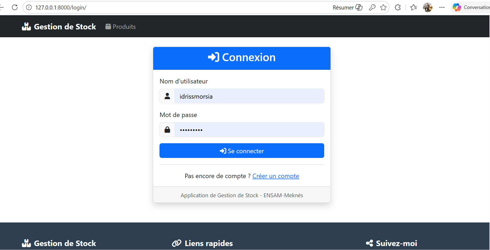
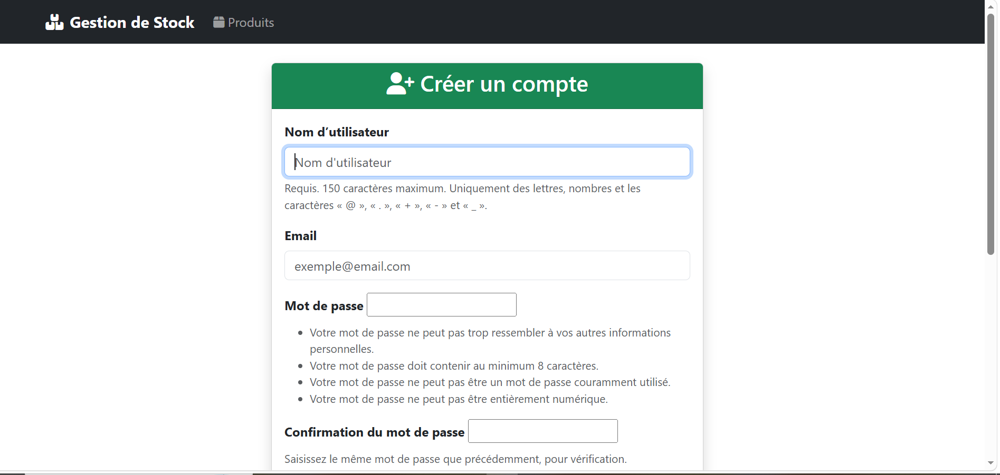
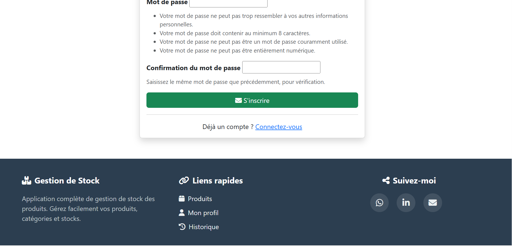

# Présentation des différentes fonctionnalités du système

Cette partie présente l’ensemble des fonctionnalités principales de l’application de gestion de stock.

L’objectif est de montrer les différentes pages disponibles dans le projet ainsi que le comportement du système selon le rôle de l’utilisateur connecté.

Après l’authentification, plusieurs types d’utilisateurs peuvent accéder à l’application :

- administrateur
- super administrateur
- utilisateur simple

Chaque rôle possède des permissions spécifiques ainsi qu’un niveau d’accès différent aux fonctionnalités du système.

Cette séparation permet de garantir la sécurité, l’organisation et le bon fonctionnement de l’application.

---

## Organisation des fonctionnalités

Les fonctionnalités du projet sont divisées en trois grandes parties :

### 1. Authentification et gestion des accès

Cette première partie concerne :

- l’inscription
- la connexion
- la déconnexion
- l’activation du compte par email
- la vérification des permissions
- la gestion des rôles utilisateurs

Elle permet de contrôler qui peut accéder au système et à quelles fonctionnalités.

## Interface de connexion et création de compte

Lorsque vous possédez déjà un compte, vous accédez directement à la page de connexion de l’application.

Cette interface permet à l’utilisateur de saisir :

- son nom d’utilisateur
- son mot de passe

afin d’accéder à son espace personnel selon son rôle (utilisateur simple, administrateur ou super administrateur).

### Vue réelle de la page de connexion

---

Si vous ne possédez pas encore de compte, il suffit de cliquer sur le bouton **"Créer un compte"** présent sur la page de connexion.

Vous serez alors redirigé vers la page d’inscription qui permet de renseigner les informations nécessaires à la création d’un nouveau compte.

### Formulaire de création de compte

---

La suite du formulaire permet de compléter les informations supplémentaires nécessaires pour finaliser l’inscription et activer le compte utilisateur.

### Suite du formulaire d’inscription

---

Une fois le formulaire validé, un email d’activation est envoyé automatiquement afin de confirmer l’adresse email et activer définitivement le compte.

---

### 2. Gestion des produits

Cette deuxième partie concerne toutes les opérations liées aux produits :

- affichage de la liste des produits
- recherche et filtrage
- ajout de nouveaux produits
- modification des produits existants
- suppression
- consultation des détails
- gestion du stock disponible

C’est le cœur principal de l’application.

---

### 3. Gestion des utilisateurs et administration

Cette troisième partie concerne les fonctionnalités réservées aux administrateurs :

- gestion des utilisateurs
- attribution des rôles
- contrôle des permissions
- supervision générale du système
- administration globale de la plateforme

Le super administrateur possède un niveau de contrôle plus élevé que l’administrateur classique.

---

## Présentation selon le rôle utilisateur

Une fois connecté, l’utilisateur accède à une interface différente selon son rôle.

### Cas 1 : Utilisateur simple

L’utilisateur simple peut principalement :

- consulter les produits
- effectuer des recherches
- visualiser les détails
- gérer certaines actions limitées selon les permissions accordées

Il ne peut pas modifier les données sensibles.

---

### Cas 2 : Administrateur

L’administrateur dispose de droits supplémentaires :

- ajouter des produits
- modifier les produits
- supprimer des produits
- gérer le stock
- superviser certaines opérations

Il participe directement à la gestion métier de l’application.

---

### Cas 3 : Super Administrateur

Le super administrateur possède le contrôle complet :

- gestion totale des utilisateurs
- attribution des permissions
- accès à toutes les opérations
- administration complète du système

Il représente le niveau d’autorisation le plus élevé.

---

Dans les sections suivantes, nous allons présenter en détail chacune de ces interfaces ainsi que les différents scénarios de fonctionnement associés à chaque rôle.

## 🌐 <b>Retrouvez-moi sur mes plateformes</b>

  <a href="https://www.linkedin.com/in/morsia-guitdam-hinimdou-266bb0269/" target="_blank" style="display:flex; align-items:center; gap:8px; text-decoration:none;">
    
    LinkedIn
  </a>

  <a href="https://github.com/hinimdoumorsia" target="_blank" style="display:flex; align-items:center; gap:8px; text-decoration:none;">
    
    GitHub
  </a>

  <a href="https://www.datacamp.com/portfolio/mhinimdou" target="_blank" style="display:flex; align-items:center; gap:8px; text-decoration:none;">
    
    DataCamp
  </a>

  <a href="https://www.kaggle.com/morsiahinimdou" target="_blank" style="display:flex; align-items:center; gap:8px; text-decoration:none;">
    
    Kaggle
  </a>

