# <span style="color:#1565C0;">Frontend — Templates et Interface Utilisateur</span>

---

## <span style="color:#1565C0;">Vue d'ensemble du frontend</span>

Le frontend repose entièrement sur le **système de templates Django** combiné à **Bootstrap 5**. Il n'y a pas de framework JavaScript séparé : toute la logique d'affichage est gérée côté serveur, et Django injecte les données dans les fichiers HTML via le moteur de templates Jinja.

##  Architecture Frontend Django

Le diagramme ci-dessous présente l'organisation hiérarchique des templates de l'application :

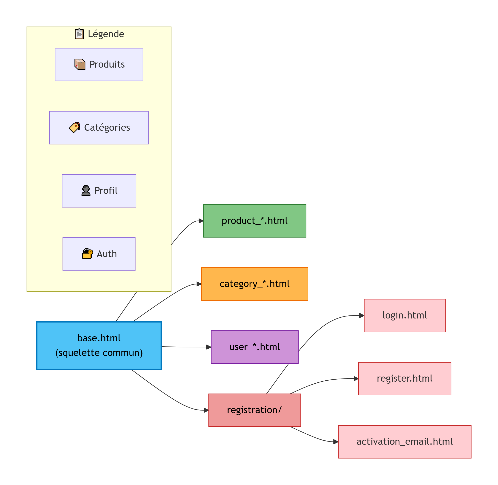

*Figure : Structure arborescente des templates frontend*

### Organisation des templates

| Dossier/Fichier | Rôle |
|----------------|------|
| **base.html** | Squelette commun (navbar, footer, messages) |
| **product_*.html** | Gestion des produits (liste, détail, formulaire, suppression) |
| **category_*.html** | Gestion des catégories (CRUD complet) |
| **user_*.html** | Profil utilisateur et historique |
| **registration/** | Authentification (login, register, activation email) |

---

## <span style="color:#1565C0;">Structure des templates</span>

```
gestion_stock/templates/
├── inventory/
│   ├── base.html                    ← Layout commun à toutes les pages
│   ├── product_list.html            ← Catalogue + filtres + pagination
│   ├── product_detail.html          ← Fiche détaillée d'un produit
│   ├── product_form.html            ← Création et modification
│   ├── product_confirm_delete.html  ← Confirmation de suppression
│   ├── category_list.html           ← Liste des catégories
│   ├── category_form.html           ← Création et modification
│   ├── category_confirm_delete.html ← Confirmation de suppression
│   ├── user_profile.html            ← Profil utilisateur
│   ├── user_profile_edit.html       ← Édition du profil
│   ├── user_change_password.html    ← Changement de mot de passe
│   └── user_history.html            ← Historique des actions
└── inventory/registration/
    ├── login.html
    ├── register.html
    ├── logout.html
    └── activation_email.html
```

---

## <span style="color:#1565C0;">Le template de base — `base.html`</span>

### Concept : l'héritage de templates Django

`base.html` joue le rôle de **squelette commun** à toutes les pages. Son principe est de centraliser tout ce qui est identique partout, et de ne laisser aux pages filles que ce qui change.

### Ce qui est centralisé dans `base.html`

| Élément | Rôle |
|---|---|
| CDNs Bootstrap / FontAwesome | Uniformité visuelle sans CSS custom lourde |
| Barre de navigation conditionnelle | Affichage différencié selon les permissions |
| Système de messages flash | Feedback utilisateur après chaque action |
| Footer | Informations de contact et liens sociaux |
| `` | Zone principale extensible par les pages filles |
| `` | CSS supplémentaire par page si besoin |
| `` | JavaScript supplémentaire par page si besoin |

### Mécanisme d'héritage

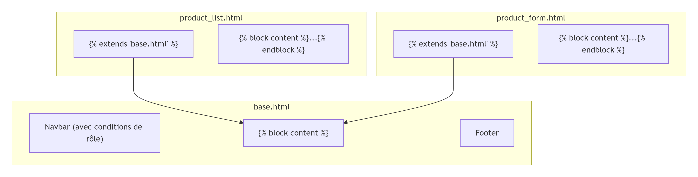

Le mécanisme fonctionne en trois étapes :

```
##  Héritage des Templates Django

Le diagramme ci-dessous illustre le mécanisme d'héritage des templates dans l'application :

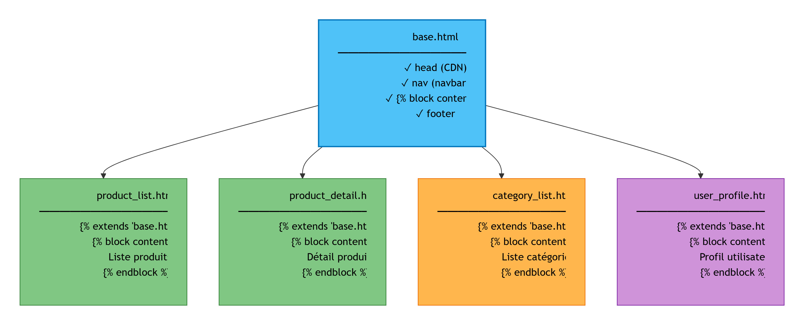

*Figure : Principe d'héritage entre base.html et les pages filles*

### Explication du mécanisme

| Élément | Rôle |
|---------|------|
| **base.html** | Template parent contenant la structure commune |
| **** | Zone remplaçable par les templates enfants |
| **** | Directive qui lie le template enfant au parent |
| **product_list.html** | Template enfant qui remplace le bloc content |

### Avantages de cette architecture

- **Factorisation du code** : Navbar, footer, CDN écrits une seule fois
- **Maintenabilité** : Modification centralisée dans base.html
- **Consistance visuelle** : Toutes les pages partagent la même structure
- **Extensibilité** : Possibilité d'ajouter des blocs supplémentaires

**Explication :**

- `` — Déclare que cette page hérite de `base.html`. Doit être la **première ligne** du fichier.
- `...` — Remplace le bloc du même nom défini dans `base.html`. Tout ce qui est hors d'un bloc est ignoré.
- Les blocs `extra_css` et `extra_js` permettent d'ajouter du CSS ou du JS spécifique à une page sans polluer toutes les autres.

### Gestion dynamique des permissions dans la navbar

La barre de navigation s'adapte automatiquement au rôle de l'utilisateur connecté :

```html
<nav class="navbar navbar-expand-lg navbar-dark bg-primary">
  <div class="container">
    <a class="navbar-brand" href="">Stock Produits</a>

    <div class="collapse navbar-collapse">
      <ul class="navbar-nav ms-auto">

        

          {# ── Lien visible par tous les connectés ──────── #}
          <li class="nav-item">
            <a class="nav-link" href="">Produits</a>
          </li>

          {# ── Lien visible uniquement par le superadmin ── #}
          
          <li class="nav-item">
            <a class="nav-link" href="">Catégories</a>
          </li>
          

          {# ── Lien de déconnexion ──────────────────────── #}
          <li class="nav-item">
            <a class="nav-link" href="">Déconnexion</a>
          </li>

        
          <li class="nav-item">
            <a class="nav-link" href="">Connexion</a>
          </li>
        

      </ul>
    </div>
  </div>
</nav>
```

**Explication :**

- `` — Vérifie que l'utilisateur est connecté. Un visiteur anonyme ne voit que le lien de connexion.
- `` — Condition qui restreint le lien "Catégories" au superadmin uniquement. Si l'utilisateur n'appartient pas à ce groupe, le lien n'est tout simplement pas rendu dans le HTML.

!!! tip "Bonne pratique"
    La sécurité ne repose **pas uniquement** sur la navbar : les vues Django protègent les URLs avec `@user_passes_test`. La navbar est une couche d'ergonomie, pas une couche de sécurité.

---

## <span style="color:#1565C0;"> La gestion des produits</span>

### Architecture des pages produits

## Gestion des Produits - Interface Utilisateur

Le diagramme ci-dessous présente l'interface de la page de liste des produits :

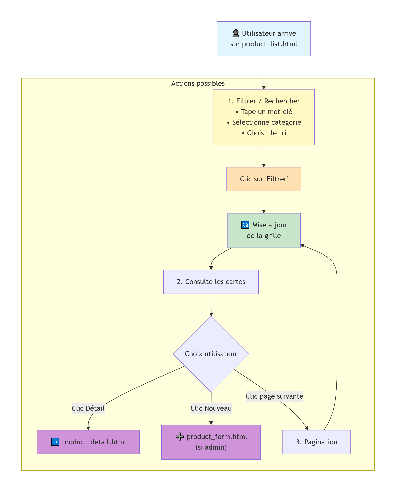

*Figure : Interface product_list.html - Catalogue des produits*

### Structure de la page

| Zone | Composants | Fonction |
|------|------------|----------|
| **Barre de filtres** | Recherche, Filtre catégorie, Tri | Affiner l'affichage des produits |
| **Grille produits** | Cartes produit (3 colonnes) | Visualisation catalogue |
| **Pagination** | Précédent, Pages, Suivant | Navigation entre les pages |

### Éléments d'une carte produit

- **Photo** : Image du produit (ou placeholder gris)
- **Nom** : Désignation du produit
- **Prix** : Tarif formaté
- **Badge stock** : Indicateur visuel (vert/orange/rouge)
- **Bouton Détail** : Accès à la fiche complète

### Comportement des badges de stock

| Statut | Couleur | Condition |
|--------|---------|-----------|
| Rupture | Rouge | stock = 0 |
| Stock faible | Orange | 0 < stock < seuil_min |
| Normal | Vert | stock >= seuil_min |

### 👇 Vue réelle de l'application (interface utilisateur)

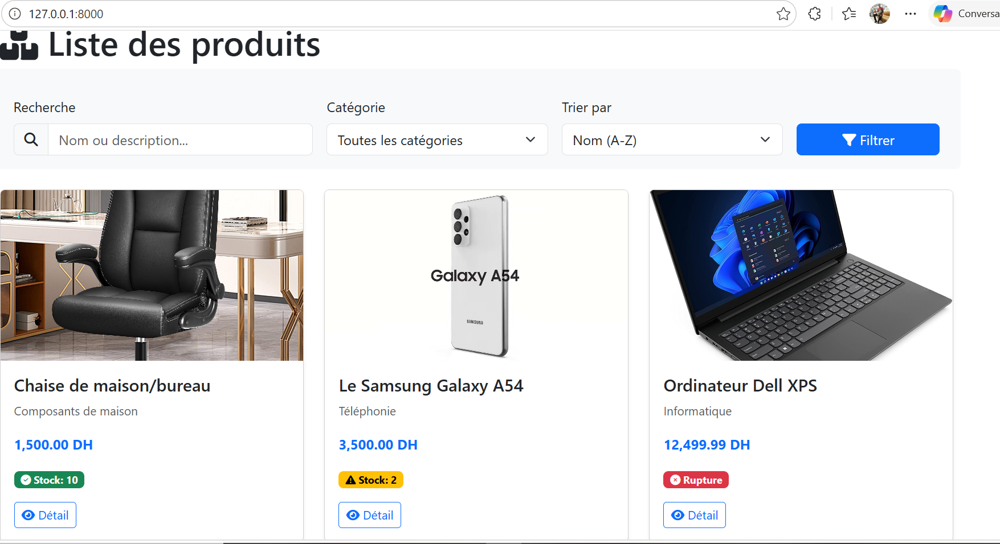

###  Remarque importante

La vue que vous voyez dans l’image correspond à des produits que j’ai déjà ajoutés en tant qu’administrateur dans l’application.

Si vous lancez l’application pour la première fois, la base de données sera vide. Il faudra donc **ajouter des produits (articles)** afin de pouvoir visualiser cette interface et tester correctement le système.

Dans mon cas, j’ai déjà inséré plusieurs produits pour illustrer le fonctionnement réel de l’application, c’est pour cela que vous les voyez affichés sur l’image.
---

| Template | Fonction | Particularité |
|---|---|---|
| `product_list.html` | Catalogue complet | Filtrage + tri + pagination |
| `product_detail.html` | Fiche détaillée | Boutons d'action conditionnels selon le rôle |
| `product_form.html` | Création / Modification | `enctype="multipart/form-data"` pour les photos |
| `product_confirm_delete.html` | Suppression | Page de confirmation obligatoire |

### Le système de filtrage

#### Scénario complet

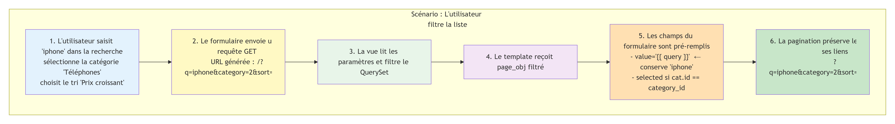

#### Code du formulaire de filtrage

```html
<!-- product_list.html -->
<form method="get" class="row g-3 mb-4">

  <!-- Champ de recherche textuelle -->
  <div class="col-md-4">
    <input type="text"
           name="q"
           value="{{ query }}"            {# (1) Conserve la valeur saisie #}
           class="form-control"
           placeholder="Rechercher un produit...">
  </div>

  <!-- Filtre par catégorie -->
  <div class="col-md-3">
    <select name="category" class="form-select">
      <option value="">Toutes les catégories</option>
      
        <option value="{{ cat.id }}"
          
            selected                      {# (2) Marque l'option active #}
          >
          {{ cat.name }}
        </option>
      
    </select>
  </div>

  <!-- Tri -->
  <div class="col-md-3">
    <select name="sort" class="form-select">
      <option value="name"  selected>Nom A-Z</option>
      <option value="-name" selected>Nom Z-A</option>
      <option value="price" selected>Prix croissant</option>
      <option value="-price"selected>Prix décroissant</option>
    </select>
  </div>

  <div class="col-md-2">
    <button type="submit" class="btn btn-primary w-100">Filtrer</button>
  </div>

</form>
```

**Explication :**

- **(1) `value="{{ query }}"`** — Réinjecte le terme de recherche dans le champ après soumission. Sans ça, le champ se viderait à chaque filtre.
- **(2) `selected`** — Compare l'ID de la catégorie avec le paramètre reçu de l'URL. Si elles correspondent, l'option reste sélectionnée visuellement.

#### Pagination avec préservation des filtres

```html
<!-- Liens de pagination qui conservent les filtres actifs -->
<nav>
  <ul class="pagination justify-content-center">

    
    <li class="page-item">
      <a class="page-link"
         href="?q={{ query }}&category={{ category_id }}&sort={{ sort }}&page={{ page_obj.previous_page_number }}">
        ◄ Précédent
      </a>
    </li>
    

    
    <li class="page-item active">
      <a class="page-link"
         href="?q={{ query }}&category={{ category_id }}&sort={{ sort }}&page={{ num }}">
        {{ num }}
      </a>
    </li>
    

    
    <li class="page-item">
      <a class="page-link"
         href="?q={{ query }}&category={{ category_id }}&sort={{ sort }}&page={{ page_obj.next_page_number }}">
        Suivant ►
      </a>
    </li>
    

  </ul>
</nav>
```

!!! tip "Point clé"
    Chaque lien de pagination reconstruit l'URL complète avec `q`, `category`, `sort` et `page`. Sans ça, cliquer sur "Page 2" effacerait tous les filtres actifs.

### Indicateurs visuels de stock

Trois badges informent instantanément l'utilisateur sur l'état du stock :

```html

  <span class="badge bg-danger">Rupture</span>


  <span class="badge bg-warning text-dark">Stock faible</span>


  <span class="badge bg-success">Disponible</span>


```

| Badge | Couleur Bootstrap | Condition |
|---|---|---|
| Rupture | `bg-danger` (rouge) | `stock == 0` |
| Stock faible | `bg-warning` (orange) | `0 < stock <= 5` |
| Disponible | `bg-success` (vert) | `stock > 5` |

### Page de détail — boutons conditionnels

```html
<!-- product_detail.html -->
<div class="card-body">
  <h3>{{ product.name }}</h3>
  <p><strong>Catégorie :</strong> {{ product.category.name }}</p>
  <p><strong>Prix :</strong> {{ product.price }} DH</p>
  <p><strong>Stock :</strong> {{ product.stock }}</p>

  {# Boutons visibles uniquement pour admin et superadmin #}
  
  <a href=""
     class="btn btn-warning"> Modifier</a>

  <a href=""
     class="btn btn-danger"> Supprimer</a>
  

</div>
```

**Explication :** Un `viewer` voit la fiche complète du produit mais ne voit aucun bouton de modification ou de suppression. Le HTML ne les contient tout simplement pas.

---

## <span style="color:#1565C0;">La gestion des catégories</span>

### Règle métier critique — protection contre la suppression

## Scénario : Suppression d'une catégorie

Le diagramme ci-dessous illustre le processus de suppression d'une catégorie selon qu'elle contient ou non des produits :

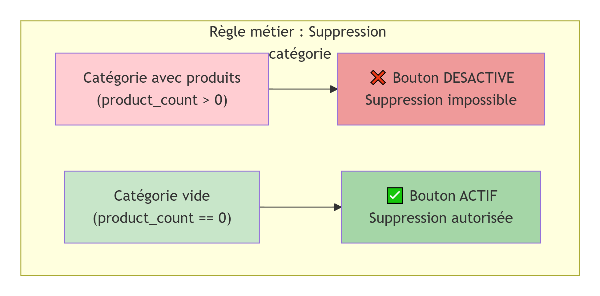

*Figure 1 : Vue globale du scénario de suppression*

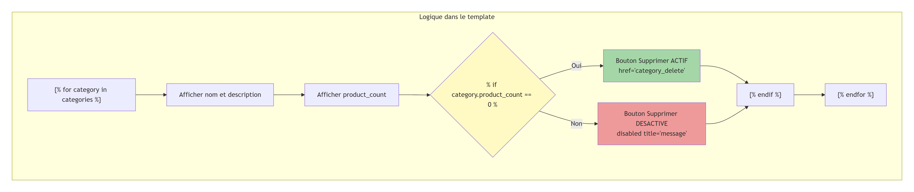

*Figure 2 : Détail du mécanisme de vérification et des états des boutons*

### Explication du scénario

| Situation | Vérification | État du bouton | Action |
|-----------|--------------|----------------|--------|
| Catégorie "Téléphones" (5 produits) | product_count = 5 (> 0) | DESACTIVE (disabled) | Suppression impossible |
| Catégorie "Archives" (0 produit) | product_count = 0 | ACTIF | Suppression autorisée |

### Règle métier implémentée

- Un superadmin ne peut pas supprimer une catégorie qui contient encore des produits
- La catégorie doit d'abord être vidée de ses produits
- Un message contextuel explique pourquoi la suppression est bloquée

```html
<!-- category_list.html -->

<tr>
  <td>{{ category.name }}</td>
  <td>{{ category.product_count }} produit(s)</td>
  <td>
    <a href=""
       class="btn btn-sm btn-warning">Modifier</a>

    
      {# Catégorie vide : suppression autorisée #}
      <a href=""
         class="btn btn-sm btn-danger">Supprimer</a>

    
      {# Catégorie avec produits : bouton désactivé #}
      <button class="btn btn-sm btn-secondary"
              disabled
              title="Impossible : cette catégorie contient des produits">
        Supprimer
      </button>
    

  </td>
</tr>

```

!!! danger "Règle métier"
    Cette logique dans le template est une couche d'ergonomie. La protection réelle contre la suppression doit aussi être gérée côté vue Django, pour éviter qu'une requête directe via l'URL contourne l'interface.

---

## <span style="color:#1565C0;">Le système d'authentification</span>

### Flux complet d'inscription

### Processus d'inscription

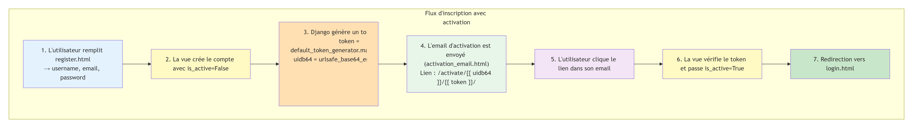

### Vue d'ensemble

Ce diagramme présente le mécanisme d'inscription sécurisée avec double vérification :

**Avantages de ce système :**
- Vérification que l'email fourni est valide
- Évite les inscriptions automatisées (bots)
- Sécurisation via token unique

**Points de sécurité :**
- Le token généré est unique et horodaté
- Le lien d'activation expire automatiquement
- Le compte reste inactif tant que l'email n'est pas confirmé

### Template d'email d'activation

```html
<!-- registration/activation_email.html -->
Bonjour {{ user.username }},

Merci de vous être inscrit sur notre plateforme.
Veuillez cliquer sur le lien ci-dessous pour activer votre compte :

http://{{ domain }}/activate/{{ uidb64 }}/{{ token }}/

Ce lien est valable 24 heures.

Cordialement,
L'équipe Gestion de Stock
```

**Variables contextuelles :**

| Variable | Valeur | Rôle |
|---|---|---|
| `{{ domain }}` | `localhost:8000` ou le domaine réel | Construit l'URL absolue |
| `{{ uidb64 }}` | ID utilisateur encodé en base64 | Identifie l'utilisateur sans exposer son ID |
| `{{ token }}` | Token unique généré par Django | Valide que le lien n'a pas été falsifié |

### Formulaire de connexion

```html
<!-- registration/login.html -->



<div class="row justify-content-center">
  <div class="col-md-5">
    <div class="card shadow-sm">
      <div class="card-body">
        <h4 class="card-title mb-4">Connexion</h4>

        <form method="post">
                       {# (1) Protection contre les attaques CSRF #}
          {{ form.as_p }}              {# (2) Rendu automatique des champs #}
          <button type="submit" class="btn btn-primary w-100">
            Se connecter
          </button>
        </form>

        <div class="mt-3 text-center">
          <a href="">Pas encore de compte ? S'inscrire</a>
        </div>
      </div>
    </div>
  </div>
</div>


```

- **(1) ``** — Token de sécurité obligatoire dans tout formulaire POST. Protège contre les attaques CSRF (Cross-Site Request Forgery). Django rejette tout formulaire sans ce token.
- **(2) `{{ form.as_p }}`** — Rendu automatique du formulaire Django avec chaque champ dans un `<p>`. Variantes : `form.as_table` ou `form.as_ul`.

---

## <span style="color:#1565C0;"> Le profil utilisateur</span>

### Structure des pages de profil

### Pages Profil Utilisateur

Le diagramme ci-dessous présente les deux interfaces principales de gestion du profil utilisateur :

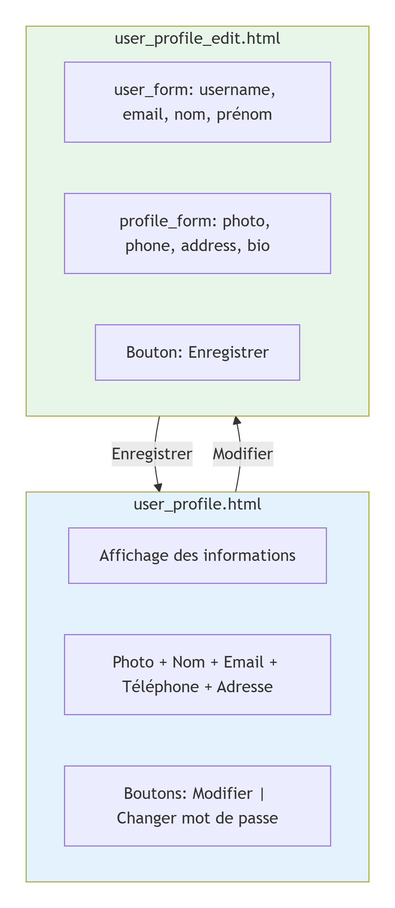

*Figure : Interface d'affichage (user_profile.html) et de modification (user_profile_edit.html)*

### Structure des pages

| Page | Composants | Fonction |
|------|------------|----------|
| **user_profile.html** | Photo de profil, Nom/Prénom, Email, Téléphone, Adresse | Affichage des informations |
| **user_profile_edit.html** | Formulaire user_form + Formulaire profile_form | Modification des données |

### Détail des formulaires

| Formulaire | Champs | Origine |
|------------|--------|---------|
| user_form | username, email, first_name, last_name | Modèle User (Django) |
| profile_form | photo, phone, address, bio | Modèle Profile (OneToOne) |

### Gestion de deux formulaires simultanés

Le profil étendu utilise un modèle `Profile` lié à `User` via `OneToOneField`. La page d'édition gère donc deux formulaires en parallèle :

```html
<!-- user_profile_edit.html -->
<form method="post" enctype="multipart/form-data">
  

  <h5>Informations du compte</h5>
  {{ user_form.as_p }}         {# (1) Champs User : username, email, prénom, nom #}

  <hr>

  <h5>Informations de profil</h5>
  {{ profile_form.as_p }}      {# (2) Champs Profile : photo, téléphone, adresse, bio #}

  <button type="submit" class="btn btn-success">Enregistrer</button>
</form>
```

- **(1) `user_form`** — Formulaire lié au modèle `User` standard de Django (champs natifs).
- **(2) `profile_form`** — Formulaire lié au modèle `Profile` (extension personnalisée). Les deux formulaires sont soumis ensemble dans le même `<form>` et traités séparément dans la vue avec deux appels `form.save()`.

| Champ Profile | Type | Rôle |
|---|---|---|
| `photo` | `ImageField` | Photo de profil |
| `phone` | `CharField` | Numéro de téléphone |
| `address` | `TextField` | Adresse postale |
| `bio` | `TextField` | Courte biographie |

---

## <span style="color:#1565C0;">L'historique des actions</span>

### Mapping visuel action → badge

```html
<!-- user_history.html -->

<tr>
  <td>{{ action.date }}</td>
  <td>
    
      <span class="badge bg-success">
        <i class="fas fa-sign-in-alt"></i> Connexion
      </span>

    
      <span class="badge bg-danger">
        <i class="fas fa-trash"></i> Suppression
      </span>

    
      <span class="badge bg-warning text-dark">
        <i class="fas fa-edit"></i> Modification
      </span>

    
      <span class="badge bg-primary">
        <i class="fas fa-plus"></i> Création
      </span>

    
      <span class="badge bg-secondary">
        <i class="fas fa-eye"></i> Consultation
      </span>
    
  </td>
  <td>{{ action.description }}</td>
</tr>

```

| Action | Couleur badge | Icône FontAwesome |
|---|---|---|
| Connexion | `bg-success` (vert) | `fa-sign-in-alt` |
| Déconnexion | `bg-secondary` (gris) | `fa-sign-out-alt` |
| Création | `bg-primary` (bleu) | `fa-plus` |
| Modification | `bg-warning` (orange) | `fa-edit` |
| Suppression | `bg-danger` (rouge) | `fa-trash` |
| Consultation | `bg-secondary` (gris) | `fa-eye` |

---

## <span style="color:#1565C0;"> Composants réutilisables</span>

### Système de messages flash

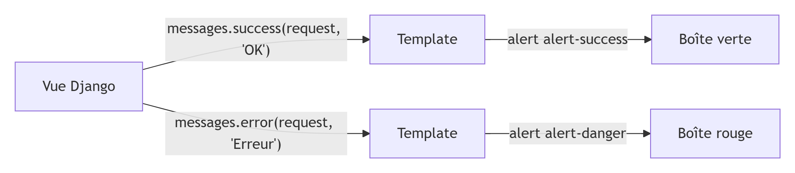

Les messages Django sont automatiquement transformés en alertes Bootstrap dans `base.html` :

```html
<!-- Dans base.html, après la navbar -->

  
    <div class="alert alert-{{ message.tags }} alert-dismissible fade show"
         role="alert">

      {{ message }}

      <button type="button"
              class="btn-close"
              data-bs-dismiss="alert"
              aria-label="Fermer">
      </button>

    </div>
  

```

## Scénario complet

### Scénario : Messages flash après action

Les diagrammes ci-dessous illustrent le mécanisme complet des messages flash Django, de la création à l'affichage :

### Vue d'ensemble du système

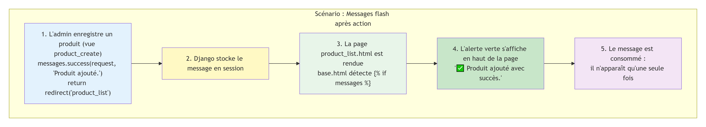

*Figure 1 : Architecture complète du système de messages flash*

### Mécanisme d'affichage des messages

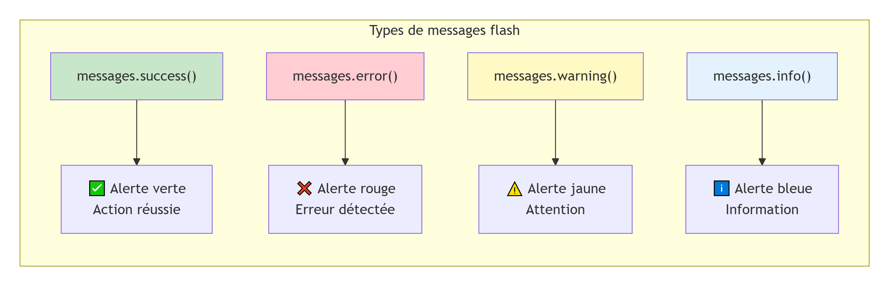

*Figure 2 : Rendu et consommation des messages dans le template*

### Explication du scénario

| Étape | Description |
|-------|-------------|
| 1 | L'admin enregistre un produit : `messages.success(request, "Produit ajouté.")` |
| 2 | Django stocke le message en session |
| 3 | La page product_list.html est rendue, base.html détecte `` |
| 4 | L'alerte verte s'affiche en haut de la page |
| 5 | Le message est consommé : il n'apparaît qu'une seule fois |

### Types de messages disponibles

| Fonction | Type d'alerte | Utilisation |
|----------|---------------|-------------|
| messages.success() | Vert (succès) | Action réussie |
| messages.error() | Rouge (erreur) | Échec ou problème |
| messages.warning() | Jaune (attention) | Avertissement |
| messages.info() | Bleu (information) | Information neutre |

**Correspondance tags Django → classes Bootstrap :**

| Tag Django | Classe Bootstrap | Couleur |
|---|---|---|
| `success` | `alert-success` | Vert |
| `error` | `alert-danger` | Rouge |
| `warning` | `alert-warning` | Orange |
| `info` | `alert-info` | Bleu clair |

### Pagination universelle

Toutes les listes du projet utilisent le même motif de pagination :

```html

<nav class="mt-4">
  <ul class="pagination justify-content-center">

    {# Bouton Précédent #}
    <li class="page-item disabled">
      <a class="page-link"
         href="?page={{ page_obj.previous_page_number }}">◄</a>
    </li>

    {# Numéros de pages #}
    
    <li class="page-item active">
      <a class="page-link" href="?page={{ num }}">{{ num }}</a>
    </li>
    

    {# Bouton Suivant #}
    <li class="page-item disabled">
      <a class="page-link"
         href="?page={{ page_obj.next_page_number }}">►</a>
    </li>

  </ul>
</nav>

```

### Footer avec liens sociaux

```html
<footer class="bg-dark text-white py-4 mt-5">
  <div class="container text-center">
    <div class="d-flex justify-content-center gap-4">

      <a href="https://wa.me/212600000000"
         class="text-white footer-icon"
         title="WhatsApp">
        <i class="fab fa-whatsapp fa-2x"></i>
      </a>

      <a href="https://linkedin.com/in/votre-profil"
         class="text-white footer-icon"
         title="LinkedIn">
        <i class="fab fa-linkedin fa-2x"></i>
      </a>

      <a href="mailto:contact@example.com"
         class="text-white footer-icon"
         title="Email">
        <i class="fas fa-envelope fa-2x"></i>
      </a>

    </div>
    <p class="mt-3 mb-0 small">
      © 2026 Gestion de Stock — ENSAM-Meknès
    </p>
  </div>
</footer>
```

---

## <span style="color:#1565C0;">Synthèse des bonnes pratiques frontend</span>

| Pratique | Implémentation dans le projet |
|---|---|
| **DRY** | Héritage de templates via ``, blocs communs dans `base.html` |
| **Sécurité** | `` dans tout formulaire POST, confirmation avant suppression, activation par email |
| **Responsive** | Bootstrap 5, grid system (`col-md-*`), navbar collapse mobile |
| **Feedback utilisateur** | Messages flash, badges de stock, bouton désactivé avec `title` explicatif |
| **Persistance d'état** | Filtres conservés dans la pagination, champs pré-remplis après soumission |
| **Accessibilité** | Icônes FontAwesome toujours accompagnées de texte, contrastes de couleurs |
| **Séparation des rôles** | Boutons conditionnels dans les templates selon `user.groups` |


## 🌐 <b>Retrouvez-moi sur mes plateformes</b>

<div style="display:flex; gap:25px; flex-wrap:wrap; align-items:center;">

  <a href="https://www.linkedin.com/in/morsia-guitdam-hinimdou-266bb0269/" target="_blank" style="display:flex; align-items:center; gap:8px; text-decoration:none;">
    
    LinkedIn
  </a>

  <a href="https://github.com/hinimdoumorsia" target="_blank" style="display:flex; align-items:center; gap:8px; text-decoration:none;">
    
    GitHub
  </a>

  <a href="https://www.datacamp.com/portfolio/mhinimdou" target="_blank" style="display:flex; align-items:center; gap:8px; text-decoration:none;">
    
    DataCamp
  </a>

  <a href="https://www.kaggle.com/morsiahinimdou" target="_blank" style="display:flex; align-items:center; gap:8px; text-decoration:none;">
    
    Kaggle
  </a>

</div>