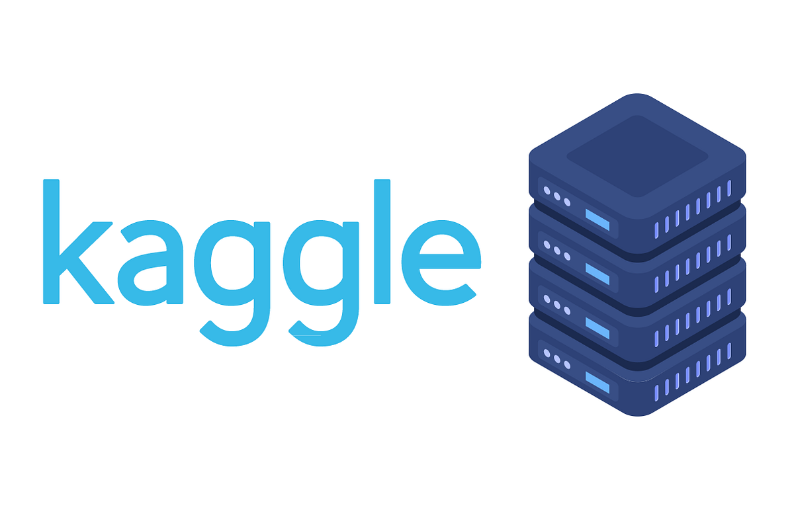

# Système de Gestion de Stock

---

##  Informations sur le projet

**Nom :** Hinimdou Morsia Guitdam  
**Rôle :** Réalisateur du projet / Élève ingénieur en Intelligence Artificielle et Data Technologies : Systèmes Industriels  
**Établissement :** ENSAM Meknès  
**Niveau :** 4ème année  
**Encadrant :** Pr Brahim BAKKAS  

---

##  **Présentation du projet**

Bienvenue dans la documentation du système de gestion de stock.

Ce projet est une application web permettant de gérer les produits d’un stock de manière simple, rapide et efficace.

Il permet de centraliser toutes les opérations liées aux produits, notamment :
- Ajout de produits
- Modification de produits
- Suppression de produits
- Suivi des quantités disponibles

---

##  **Objectif du système**

Ce projet vise à remplacer les méthodes manuelles de gestion de stock par une solution numérique fiable, rapide et organisée, permettant ainsi d’améliorer la gestion des ressources, la précision des données et la prise de décision.

Au-delà de cet objectif principal, cette documentation a également pour but de présenter de manière progressive et structurée les différentes étapes de réalisation du projet. Elle est conçue pour aider tout débutant ou développeur à comprendre facilement le fonctionnement du système, son architecture, ainsi que le code source, afin de pouvoir le reproduire et l’adapter sans difficulté.

Enfin, ce projet met également l’accent sur la compréhension du framework **Django en Python**, reconnu pour sa puissance, sa simplicité et sa capacité à accélérer le développement d’applications web robustes et sécurisées.

---

## **Navigation**

👉 Utilisez le menu à gauche pour explorer les différentes sections de la documentation.

---

## 🌐 <b>Retrouvez-moi sur mes plateformes</b>

  <a href="https://www.linkedin.com/in/morsia-guitdam-hinimdou-266bb0269/" target="_blank" style="display:flex; align-items:center; gap:8px; text-decoration:none;">
    
    LinkedIn
  </a>

  <a href="https://github.com/hinimdoumorsia" target="_blank" style="display:flex; align-items:center; gap:8px; text-decoration:none;">
    
    GitHub
  </a>

  <a href="https://www.datacamp.com/portfolio/mhinimdou" target="_blank" style="display:flex; align-items:center; gap:8px; text-decoration:none;">
    
    DataCamp
  </a>

  <a href="https://www.kaggle.com/morsiahinimdou" target="_blank" style="display:flex; align-items:center; gap:8px; text-decoration:none;">
    
    Kaggle
  </a>

